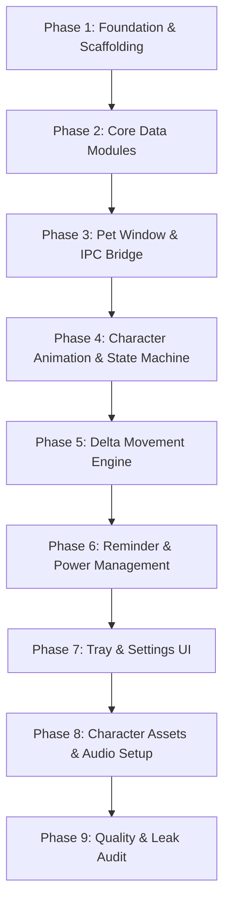

# Kiko (Electron) — Detailed Implementation Plan

> **Source Architecture Reference:** [ARCHITECTURE (1).md](file:///e:/insta%20reels%20projects/Kiko-DestopApp/ARCHITECTURE%20(1).md)  
> **Target OS:** Windows 10 / 11 (x64)  
> **Tech Stack:** Electron (Vanilla JS / HTML5 / CSS3, No bundler, No frameworks)

---

## 1. Executive Summary & Architectural Understanding

This project is a lightweight, high-performance desktop companion pet application for Windows built with Electron. The architecture prioritizes low resource consumption (RAM/CPU), instant responsiveness, zero unnecessary dependencies, and support for multiple superhero/chibi characters.

### Core Architectural Principles
1. **Zero External Runtime Dependencies:** Only `electron` and `electron-builder` (dev). No UI frameworks (React/Vue/Tailwind), no state management libraries, and no third-party store modules (like `electron-store`).
2. **Strict Process & Timer Discipline:**
   - Single persistent `BrowserWindow` (transparent, frameless, topmost).
   - Settings window is created **on-demand** and destroyed (`win = null`) on close to free RAM.
   - Timers exist **only** when strictly required (movement timer runs only during `WALKING`; reminder timer is a single `setTimeout` to an absolute timestamp).
3. **Hardware-Efficient Rendering & Hybrid Animation Engine:**
   - Supports both multi-frame CSS sprite sheets (via `steps()`) and high-res single-pose chibi characters with GPU-accelerated CSS micro-animations (web-swinging, hover floating, spell pulse, breathing, bobbing).
4. **Intelligent Click-Through & Dragging:**
   - Window has `setIgnoreMouseEvents(true, { forward: true })` by default.
   - Cursor hovering over the pet/bubble triggers `setIgnoreMouseEvents(false)`. Leaving triggers `setIgnoreMouseEvents(true, { forward: true })`.
   - Window drag is handled manually via renderer mouse deltas + IPC, avoiding native `-webkit-app-region: drag` issues.
5. **Dynamic Pet Manifest Engine:** Pets are fully modular folders under `/pets/<pet-id>/` with `manifest.json` and image/sheet assets. Adding new pets requires zero code changes.

---

## 2. Supported Character Roster & Visual Behaviors

The application comes pre-loaded with the 7 characters provided in the `images/` directory:

| Pet ID | Name & Description | Visual Style & Idle Micro-Animation | Custom Reminder Dialogue |
|---|---|---|---|
| `spiderman` | 🕷️ **Spider-Man (Upside Down)** | Web-hanging pendulum sway with gentle bobbing | *"Hey webslinger! It's been 1 hour. Grab some water 💧"* |
| `deadpool` | 🔴 **Deadpool (Hanging)** | Upside down hanging wink with funny sway | *"Drink water right now or I'm breaking the 4th wall! 🥤"* |
| `deadcho` | ⚡ **Deadcho (Pikachu + Deadpool)** | Twin katanas stance with energetic ear bounce | *"Pika-pika! Time for a hydration boost! ⚡💧"* |
| `drstrange` | 🔮 **Doctor Strange** | Mystic arts shields with glowing pulse rotation | *"By the Vishanti, your body requires hydration! 🔮💧"* |
| `ironman` | 🤖 **Iron Man (Tony Stark)** | Arc reactor pulse with subtle thruster hover | *"JARVIS says your hydration levels are low. Drink up! 🤖"* |
| `marvel-deadpool` | ⚔️ **Deadpool (Attitude)** | Chibi pose with breathing and playful stance | *"Hydrate or diedrate, buddy! Drink some H2O! 💧"* |
| `wolverine` | 🐾 **Wolverine (Logan)** | Claws-out stance with bouncy grin | *"Even mutant healing needs water, bub! 🐾💧"* |

---

## 3. Directory & Module Blueprint

```
Kiko-DestopApp/
├── package.json
├── electron-builder.yml
├── ARCHITECTURE.md
├── IMPLEMENTATION_PLAN.md
├── images/                      # Raw source character illustrations
│   ├── deadcho.png
│   ├── deadpool.png
│   ├── drstrange.png
│   ├── ironman.png
│   ├── marvel.png
│   ├── spiderman3.png
│   └── woolverine.png
├── src/
│   ├── main/
│   │   ├── main.js              # Application lifecycle, single-instance lock, module wiring
│   │   ├── petWindow.js         # Transparent overlay window, screen clamping, click-through management
│   │   ├── movement.js          # Walking coordinates calculation & delta-based movement loop
│   │   ├── reminder.js          # Single-timeout reminder scheduler & powerMonitor handlers
│   │   ├── tray.js              # System tray icon, context menus (radios, toggles, actions)
│   │   ├── settings.js          # Handcrafted JSON settings manager with debounced disk persistence
│   │   ├── settingsWindow.js    # On-demand settings UI window manager
│   │   ├── petLoader.js         # Manifest scanner and validator for /pets directory
│   │   └── ipc.js               # Centralized, strictly validated IPC handlers
│   ├── preload/
│   │   ├── preload.js           # Minimal contextBridge whitelist for pet renderer
│   │   └── settingsPreload.js   # Minimal contextBridge whitelist for settings renderer
│   └── renderer/
│       ├── pet/
│       │   ├── pet.html         # Pet DOM structure & strict CSP
│       │   ├── pet.css          # CSS sprite sheet engine, character animations & speech bubble styling
│       │   └── pet.js           # Visual state machine, hover hit-testing & drag event dispatcher
│       └── settings/
│           ├── settings.html     # Settings UI tabbed forms
│           ├── settings.css      # Dark-mode native-feel settings styling
│           └── settings.js       # Form bindings and IPC sync
├── pets/
│   ├── spiderman/
│   │   ├── manifest.json
│   │   └── sprite.png
│   ├── deadpool/
│   │   ├── manifest.json
│   │   └── sprite.png
│   ├── deadcho/
│   │   ├── manifest.json
│   │   └── sprite.png
│   ├── drstrange/
│   │   ├── manifest.json
│   │   └── sprite.png
│   ├── ironman/
│   │   ├── manifest.json
│   │   └── sprite.png
│   ├── marvel-deadpool/
│   │   ├── manifest.json
│   │   └── sprite.png
│   └── wolverine/
│       ├── manifest.json
│       └── sprite.png
└── assets/
    ├── tray.ico                 # System tray icon
    └── water.wav                # Audio reminder alert
```

---

## 4. Data Contracts & State Schemas

### 4.1 Pet Manifest Schema (`pets/<id>/manifest.json`)
```json
{
  "id": "spiderman",
  "name": "Spider-Man",
  "type": "illustration",
  "animationType": "swing",
  "size": [140, 180],
  "states": {
    "idle":     { "fps": 4, "animation": "pet-swaying" },
    "walking":  { "fps": 8, "animation": "pet-walking" },
    "reminder": { "fps": 6, "animation": "pet-alert" },
    "drinking": { "fps": 5, "animation": "pet-drinking" },
    "sleeping": { "fps": 2, "animation": "pet-sleeping" }
  },
  "messages": [
    "🕷️ Hey webslinger! It's been 1 hour. Grab some water 💧",
    "💧 Stay hydrated to keep those reflexes sharp!",
    "🥤 Spider-Sense says it's time for a water break!"
  ]
}
```

### 4.2 Persistent Settings Schema (`settings.json`)
Stored at `app.getPath('userData')/settings.json`:
```json
{
  "petId": "spiderman",
  "position": { "x": 100, "y": 600 },
  "alwaysOnTop": true,
  "movementEnabled": true,
  "startWithWindows": false,
  "reminderEnabled": true,
  "intervalMinutes": 60,
  "paused": false,
  "sound": true,
  "notification": false,
  "scale": 1.0,
  "animationSpeed": 1.0
}
```

### 4.3 IPC Interface Contract (`window.pet`)

| Channel | Direction | Payload | Validation / Purpose |
|---|---|---|---|
| `set-pet` | Main → Pet Renderer | `{ manifest, imagePath, scale, speed }` | Load pet data, image source & update CSS variables |
| `show-reminder` | Main → Pet Renderer | `{ message: string }` | Triggers REMINDER animation state & speech bubble |
| `set-movement` | Main → Pet Renderer | `{ enabled: boolean }` | Enables/disables random walk triggers |
| `walk-start` | Pet Renderer → Main | `{ direction: 1 \| -1 }` | Renderer requests main to start movement loop |
| `walk-stop` | Pet Renderer → Main | None | Renderer notifies main that walk cycle ended |
| `drag-delta` | Pet Renderer → Main | `{ dx: number, dy: number }` | Main adjusts pet window position instantly |
| `drag-end` | Pet Renderer → Main | None | Main saves final clamped window coordinates to settings |
| `set-ignore-mouse`| Pet Renderer → Main | `boolean` | Dynamically enables/disables click-through |
| `get-settings` | Settings Renderer → Main | None | Retrieves current merged settings object |
| `update-settings` | Settings Renderer → Main | `Partial<Settings>` | Updates settings, applies side effects, writes to disk |

---

## 5. Detailed Implementation Phases



---

### Phase 1: Foundation & Scaffolding
- **Goal:** Set up package configuration, development scripts, and folder structure.
- **Tasks:**
  1. Initialize `package.json` with scripts:
     - `"start": "electron ."`
     - `"dist": "electron-builder"`
     - Dev dependencies: `electron` (latest stable), `electron-builder`.
  2. Create `electron-builder.yml` configuring:
     - `appId`: `com.desktop.pet`
     - `productName`: `SpiderManPet`
     - Targets: `nsis` (oneClick per-user) + `portable`, `x64`
     - `asar: true`, `electronLanguages: ["en-US"]`
     - File inclusions/exclusions.
  3. Create directory tree (`src/main`, `src/preload`, `src/renderer/pet`, `src/renderer/settings`, `pets/`, `assets/`).

---

### Phase 2: Core Data Modules (Main Process)

#### Module 2.1: `src/main/settings.js`
- **Responsibilities:**
  - Load `settings.json` from `app.getPath('userData')`.
  - Fallback to hardcoded defaults if file does not exist or JSON is corrupt.
  - Deep-merge existing settings with defaults (handles schema additions seamlessly).
  - Provide synchronous/in-memory `get()` and `set()`.
  - Debounce disk write operations (`500ms`) using `fs.promises.writeFile`.

#### Module 2.2: `src/main/petLoader.js`
- **Responsibilities:**
  - Scan the `/pets` directory at application startup.
  - Read each subfolder and validate `manifest.json` and image asset (`sprite.png` or `sheet.png`).
  - Return a sanitized list of valid pet objects; log warnings for invalid pet folders without crashing.
  - Fallback mechanism: if default `petId` is missing, select the first valid pet in list.

---

### Phase 3: Pet Window & IPC Bridge

#### Module 3.1: `src/main/petWindow.js`
- **Responsibilities:**
  - Create the transparent, frameless, non-focusable, always-on-top `BrowserWindow`.
  - Window dimensions: `200x240` (reserves vertical headroom for the speech bubble and hanging characters).
  - Apply `win.setAlwaysOnTop(true, 'screen-saver')`.
  - Initialize click-through: `win.setIgnoreMouseEvents(true, { forward: true })`.
  - Display clamping logic:
    - On startup, read `settings.position`.
    - Validate coordinates against `screen.getDisplayNearestPoint(pos).workArea`.
    - If off-screen, center pet at bottom right of primary display.

#### Module 3.2: `src/preload/preload.js`
- **Responsibilities:**
  - Expose `window.pet` API via `contextBridge.exposeInMainWorld`.
  - Safe IPC wrapper methods: `onSetPet`, `onShowReminder`, `onSetMovement`, `startWalk`, `stopWalk`, `sendDragDelta`, `sendDragEnd`, `setIgnoreMouse`.
  - Clean up event listeners to prevent renderer memory leaks.

#### Module 3.3: `src/main/ipc.js`
- **Responsibilities:**
  - Register all `ipcMain.on` and `ipcMain.handle` listeners in one clean module.
  - Validate all payloads before acting.
  - Bridge drag deltas: update `petWindow.setPosition(currentX + dx, currentY + dy)`.
  - Toggle `petWindow.setIgnoreMouseEvents(ignore, { forward: true })`.

---

### Phase 4: Character Animation & Renderer State Machine

#### Module 4.1: `src/renderer/pet/pet.html` & `pet.css`
- **Responsibilities:**
  - Strict Content Security Policy (CSP): `default-src 'self'; img-src 'self' file: data:; style-src 'self' 'unsafe-inline'; media-src 'self' file:;`.
  - Pet character container `#pet-container` and image `#pet-image`.
  - CSS Micro-Animations tailored to characters:
    - `@keyframes swing`: Smooth pendulum oscillation for hanging Spider-Man and Deadpool.
    - `@keyframes hoverFloat`: Subtle vertical floating for Iron Man.
    - `@keyframes pulseGlow`: Glowing aura for Doctor Strange.
    - `@keyframes cuteBounce`: Playful bouncing for Deadcho and Wolverine.
  - Speech bubble element `#speech-bubble`:
    - Positioned directly above/beside the character.
    - Glassmorphism / clean dark background with subtle shadow (no harsh borders).
    - CSS opacity transitions for smooth 8-second fade-in/out.

#### Module 4.2: `src/renderer/pet/pet.js`
- **Responsibilities:**
  - State Machine implementation:
    - States: `IDLE`, `WALKING`, `REMINDER`, `DRINKING`, `SLEEPING`, `HIDDEN`.
    - Transition table with clean state exit/entry handlers (clearing timeouts on exit).
    - Inactivity timer: 10 minutes of no user interaction transitions `IDLE` → `SLEEPING`.
    - Sleeping pauses animation (`.paused` class). Click/drag awakens pet to `IDLE`.
  - Click-through & Drag handling:
    - Hit-testing: Track `mousemove` on `#pet-image` and `#speech-bubble`. When entered, call `window.pet.setIgnoreMouse(false)`. When leaving, call `window.pet.setIgnoreMouse(true)`.
    - Custom Dragging: Track `mousedown` on pet -> `window.addEventListener('mousemove', onDrag)` -> compute `(e.screenX - startX, e.screenY - startY)` -> `window.pet.sendDragDelta()` -> on `mouseup` -> `window.pet.sendDragEnd()`.

---

### Phase 5: Delta Movement Engine (Main Process)

#### Module 5.1: `src/main/movement.js`
- **Responsibilities:**
  - Manage horizontal wandering logic along the bottom of the current monitor work area.
  - Zero-timer guarantee: `movement.js` has **NO active timer/interval** during `IDLE`.
  - When renderer triggers `walk-start`:
    - Start a `setInterval` (~30ms tick rate).
    - Use `performance.now()` delta calculation to ensure frame-rate independent smooth movement.
    - Monitor boundary detection: if pet reaches screen edge, reverse direction (`direction *= -1`).
    - Once random target distance is reached, notify renderer and call `clearInterval(walkInterval)`.
  - Multi-monitor safety: constrain movement to `screen.getDisplayNearestPoint(petPos).workArea`.

---

### Phase 6: Reminder & Power Management

#### Module 6.1: `src/main/reminder.js`
- **Responsibilities:**
  - Store `nextDueTimestamp = Date.now() + (intervalMinutes * 60 * 1000)`.
  - Arm a single `setTimeout` for the remaining duration.
  - On trigger:
    - Select a random character-specific message from current pet manifest.
    - Dispatch `show-reminder` IPC event to renderer.
    - Play `assets/water.wav` (if sound is enabled).
    - Display native Windows notification via Electron `Notification` (if notifications are enabled).
    - Re-arm the next timeout.
  - Pause / Resume:
    - When paused, store remaining time (`remaining = nextDue - Date.now()`), clear timeout.
    - When resumed, schedule timeout with `remaining`.
  - Windows Sleep/Resume (`powerMonitor`):
    - Listen for `powerMonitor.on('resume')`.
    - Recompute `nextDue - Date.now()`.
    - If `nextDue <= Date.now()` (expired while PC was asleep), fire reminder **once immediately** (prevent burst reminders), then schedule normal interval.

---

### Phase 7: System Tray & Settings Window

#### Module 7.1: `src/main/tray.js`
- **Responsibilities:**
  - Create Windows system tray icon (`assets/tray.ico`).
  - Context menu layout:
    - **Pause / Resume Reminder** (Toggle label)
    - **Interval Submenu:** [15m, 30m, 45m, 60m, 90m, 120m] (Radio items)
    - **Choose Pet Submenu:** Dynamic list of all 7 characters (`petLoader.getPets()`) (Radio items)
    - **Separator**
    - **Always On Top** (Checkbox)
    - **Movement Enabled** (Checkbox)
    - **Sound Alert** (Checkbox)
    - **Separator**
    - **Settings...** (Opens Settings Window)
    - **Hide / Show Pet** (Toggle)
    - **Exit** (`app.quit()`)
  - Double-click on tray icon focuses or toggles pet visibility.

#### Module 7.2: `src/main/settingsWindow.js` & Settings UI
- **Responsibilities:**
  - Single-instance on-demand window (`width: 500, height: 600`).
  - Framed, native title bar, centered on display.
  - Destroyed on close (`win.on('closed', () => { settingsWin = null; })`) to release RAM.
  - Settings UI (`settings.html`, `settings.css`, `settings.js`):
    - Dark mode modern dashboard with tabs: **General**, **Reminder**, **Appearance** (with character selector preview cards).
    - Live sync: modifying scale or speed sends real-time updates to pet window.
    - Auto-start toggle interacts with `app.setLoginItemSettings({ openAtLogin: enabled })`.

---

### Phase 8: Character Assets & Audio Setup
- **Responsibilities:**
  - Organize the 7 character images from `images/` into their respective `/pets/<id>/` folders with tailored `manifest.json`.
  - Generate a sharp, clean 32x32 / 256x256 `assets/tray.ico`.
  - Generate/provide a crisp hydration chime `assets/water.wav`.

---

### Phase 9: Quality Assurance, Leak Audit & Packaging
- **Verification Checklist:**
  1. **RAM Audit:** Ensure base memory footprint stays within 90–140 MB on idle.
  2. **Timer Audit:** Verify in DevTools / profiling that no `setInterval` or `requestAnimationFrame` loops run in IDLE state.
  3. **Multi-Display Check:** Disconnect/reconnect monitor or change resolution; ensure pet does not disappear off-screen.
  4. **Single-Instance Lock:** Launching second instance must bring existing pet to front and exit second instance.
  5. **Build Test:** Run `npm run dist` and verify that both NSIS setup `.exe` and Portable `.exe` build without errors.

---

## 6. Execution Status & Next Action

- **Current Status:** Planning & Roster Mapping Complete.
- **Next Immediate Action:** Begin Phase 1 (Scaffolding & Package Setup) and Phase 2 (Core Modules & Character Manifest Creation).
